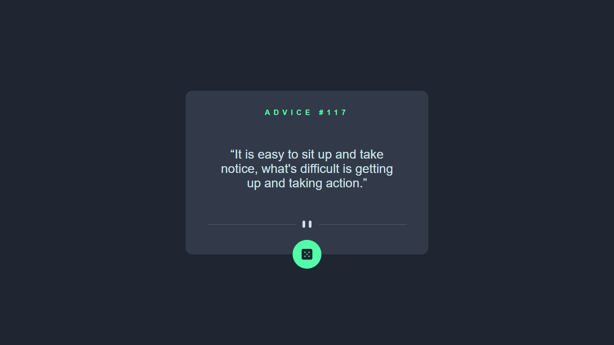
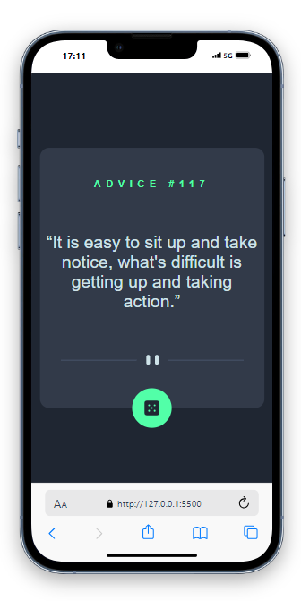

# Frontend Mentor - Advice generator app solution

This is a solution to the [Advice generator app challenge on Frontend Mentor](https://www.frontendmentor.io/challenges/advice-generator-app-QdUG-13db). Frontend Mentor challenges help you improve your coding skills by building realistic projects.

## Table of contents

- [Overview](#overview)
  - [The challenge](#the-challenge)
  - [Screenshot](#screenshot)
  - [Links](#links)
- [My process](#my-process)
  - [Built with](#built-with)
  - [What I learned](#what-i-learned)
  - [Continued development](#continued-development)
  - [Useful resources](#useful-resources)
- [Author](#author)
- [Acknowledgments](#acknowledgments)

## Overview

### The challenge

Users should be able to:

- To see advice
- To see next advice
- To even use the app in mobile

### Screenshot

### Links

- Solution URL: https://delicate-florentine-52ef6b.netlify.app/
- Live Site URL: https://delicate-florentine-52ef6b.netlify.app/

## My process

### Built with

- Semantic HTML5 markup
- CSS custom properties
- Flexbox
- Mobile-responsive also

### What I learned

Using DOM manipulation techniques to manipulate DOM and events, and also using api call, so that to make actual web application.

### Continued development

I wont to continue having more advanced DOM feature and build more application

### Useful resources

this helped accelerated me to more up to come, and all the project ahead, I am pretty sure that I can get them done.

## Author

https://github.com/omarkarake/

## Acknowledgments

Thanks my colleagues and my teacher, they are instrumental that make us want to improve everyday.
